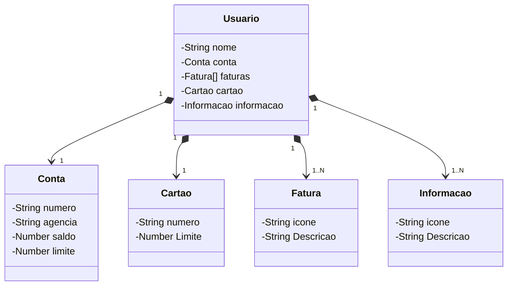

# SpringBootJavaDio2024
Java Restful API.

## Diagrama de Classes

```mermaid
classDiagram

  class Usuario{
    -String nome
    -Conta conta
    -Fatura[] faturas
    -Cartao cartao
    -Informacao informacao
  }

  class Conta{
    -String numero
    -String agencia
    -Number saldo
    -Number limite
  }

 class Cartao{
   -String numero
   -Number Limite
 }

  class Fatura{
    -String icone
    -String Descricao
  }

  class Informacao{
    -String icone
    -String Descricao
  }
      
Usuario"1" *-->"1" Conta
Usuario"1" *-->"1" Cartao
Usuario "1" *-->"1..N" Fatura
Usuario "1" *-->"1..N" Informacao
```
